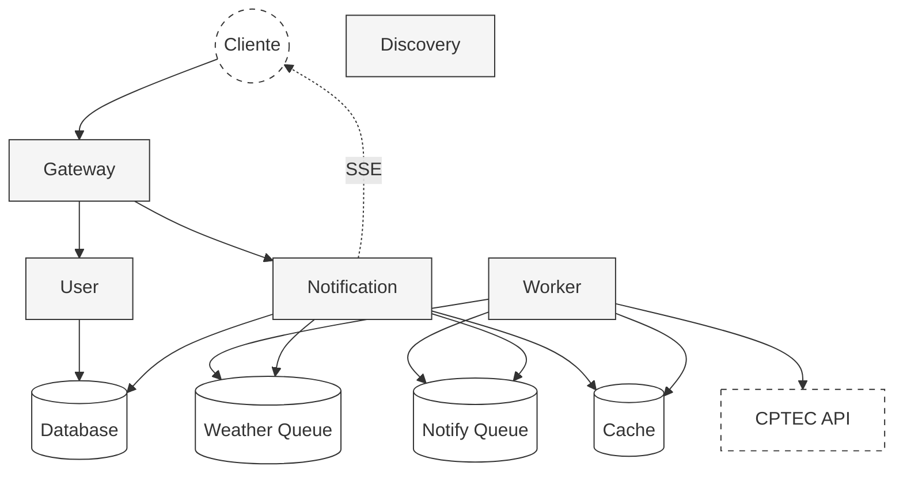

# Meli Climate Hub

<div align="center">
  

  <p align="center">
    Sistema de notificações climáticas desenvolvido como parte do desafio técnico para o Mercado Livre.
  </p>

  <p align="center">
    
    
    
    
    <br/>
    
    
    
    
    
  </p>
</div>

## Sobre o Desafio

O desafio proposto pelo Mercado Livre consistia em desenvolver uma solução de microserviços para gerenciamento de notificações climáticas. O objetivo era demonstrar conhecimentos em arquitetura distribuída, práticas de desenvolvimento e padrões de projeto.

> "Apesar do prazo desafiador, mergulhei de cabeça no projeto. Foi uma experiência extremamente enriquecedora que me permitiu aplicar e expandir meus conhecimentos em arquitetura de microserviços."

## Arquitetura



## 🔍 Componentes Principais

| Componente | Tecnologia | Responsabilidade |
|------------|------------|------------------|
| Frontend | Angular 19 | Interface do Usuário, Gestão de Estado |
| API Gateway | Spring Cloud Gateway | Roteamento, Load Balancing, Autenticação JWT |
| User Service | Spring Boot | Autenticação, Gestão de Usuários, JWT |
| Notification Service | Spring Boot | Agendamentos, Eventos, Persistência |
| Notification Worker | Spring Boot | Processamento Assíncrono, Integração CPTEC |
| Service Discovery | Netflix Eureka | Service Registry, Load Balancing |
| Message Broker | RabbitMQ | Comunicação Assíncrona |
| Cache | Redis | Cache de Dados Climáticos |
| Database | H2 Database | Persistência de Dados |

## ⭐ Destaques Técnicos

- **Arquitetura Distribuída**: Microserviços independentes com Service Discovery
- **Comunicação em Tempo Real**:
  - Server-Sent Events (SSE) para notificações em tempo real
  - Conexões persistentes para atualizações climáticas
  - Baixa latência na entrega de notificações
- **Segurança**: 
  - Autenticação JWT implementada no API Gateway
  - Filtros de segurança em cada serviço
  - Tokens com expiração e renovação automática
- **Resiliência**: 
  - Circuit breaker configurado para chamadas externas
  - Retry policies no RabbitMQ
  - Healthchecks em todos os serviços
- **Observabilidade**: 
  - Actuator endpoints configurados
  - Logging estruturado com níveis apropriados
- **Clean Code**: 
  - Uso de DTOs e Mappers (MapStruct)
  - Injeção de dependências
  - Princípios SOLID

## 🚀 Executando o Projeto

### Pré-requisitos
- Docker v2+ e Docker Compose
- Java 21
- Maven
- Node.js 20+ (apenas para desenvolvimento)

### Inicialização

```bash
# Build e execução dos serviços
docker compose -f ./docker/docker-compose.yaml up --build

# Versões antigas do Docker
docker-compose -f ./docker/docker-compose.yaml up --build
```

### Frontend

```bash
# Build e execução do frontend
# Precisa estar dentro da pasta meli-climatehub-frontend
cd meli-climatehub-frontend
ng serve
```

### 🌐 Endpoints Principais

- Frontend (Interface Web): http://localhost:4200
- Eureka Dashboard: http://localhost:8761
- API Gateway: http://localhost:8080
- SSE Notifications: http://localhost:8080/notification/stream

### 🖥️ Acessando a Aplicação

Após iniciar todos os serviços com Docker Compose:

1. Abra seu navegador e acesse: http://localhost:4200
2. Na primeira vez, você precisará criar uma conta usando a opção "Register"
3. Faça login com suas credenciais
4. Você será redirecionado para o dashboard onde poderá:
   - Criar novas notificações climáticas
   - Gerenciar notificações existentes
   - Receber atualizações em tempo real

---
<div align="center">
  <sub>Construido con ❤️ para el desafío técnico de Mercado Livre.</sub>
</div>