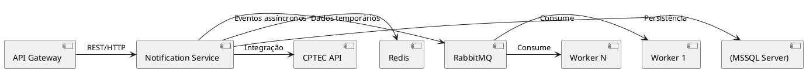
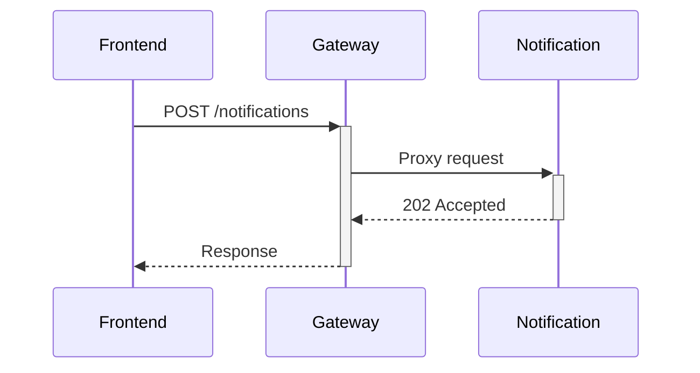
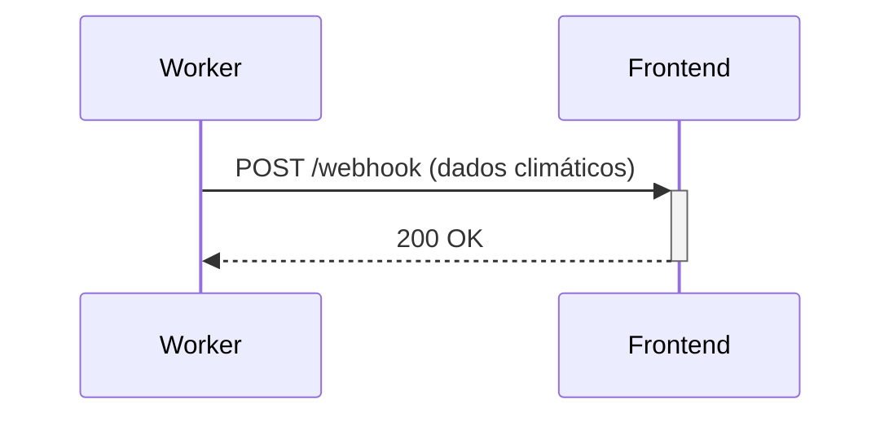

# meli-climate-notifications

Sistema de notificações climáticas integrado com CPTEC.

## Arquitetura proposta



## Arquitetura e Design Decisions

### 1. Componentes Principais

| Componente | Tecnologia | Responsabilidade |
|------------|------------|------------------|
| API Gateway | Spring Cloud Gateway | Roteamento, Load Balancing, Auth |
| Notification Service | Spring Boot | Lógica de negócio, agendamentos |
| Workers | Spring + RabbitMQ | Processamento assíncrono |
| Banco de Dados | MSSQL Server | Dados persistentes (agendamentos, users) |
| Cache | Redis | Dados climáticos (TTL: 1h) |

### 2. Padrões de Comunicação

#### Síncrono (Frontend → API Gateway → Notification Service):


#### Assíncrono (Worker → Frontend via Webhook/SSE):


### 3. Fluxo de Agendamento

#### Frontend
- Solicita agendamento via API Gateway

#### Notification Service
- Valida regras (opt-out)
- Persiste no MSSQL Server
- Publica evento no RabbitMQ

#### Worker(s)
- Consome evento na hora agendada
- Busca dados atualizados (CPTEC + cache)
- Notifica frontend via Webhook/SSE

### 4. Resiliência

- Retry com backoff exponencial (RabbitMQ)
- Circuit Breaker para chamadas CPTEC

### 5. Escalabilidade

- Workers dinâmicos (docker-compose scale worker=5)


# Subir o backend (microserviços)

Na raiz do projeto rode o seguinte comando:

caso tenha o docker V2:
```bash
docker compose -f ./docker/docker-compose.yaml up --build
```

caso tenha o docker com a versão anterior da V2:
```bash
docker-compose -f ./docker/docker-compose.yaml up --build
```